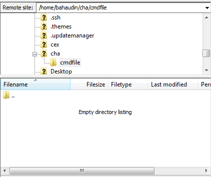

# SFTP File Transfer
In my workplace, I need to upload some files to SFTP server through [FileZilla](https://filezilla-project.org/)
FTP Client for multiple times. Then logging into the server with HostAddress, port number, username & password;
then setting up the remote path and draging the files into it for multiple times, its kinda tedious. 

So here is a exammple of sending files to a remote server with a single click. Just put the 
files into the required local directory and set the remote path in the code and hit run. The 
job is done!!

## Dependencies

In the command window execute the following commands. Make sure of that path of **_pip_** is added to system environment variable.

  ` pip install pysftp`

## Output

_Empty Directory before running the script_

_Files are transferred after running the script_

